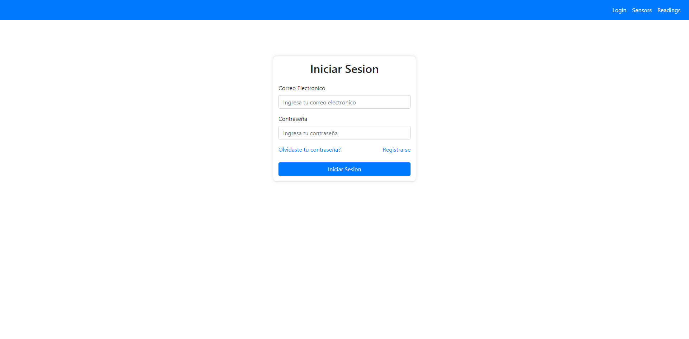
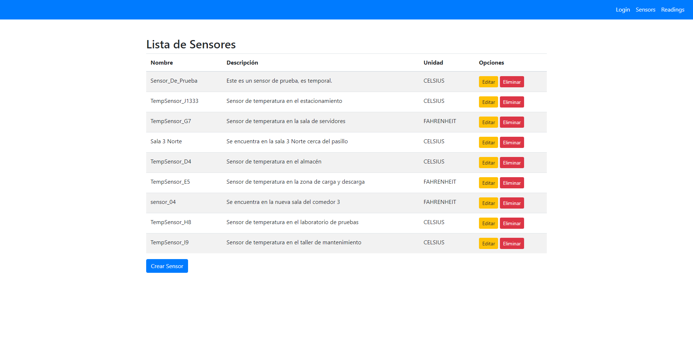
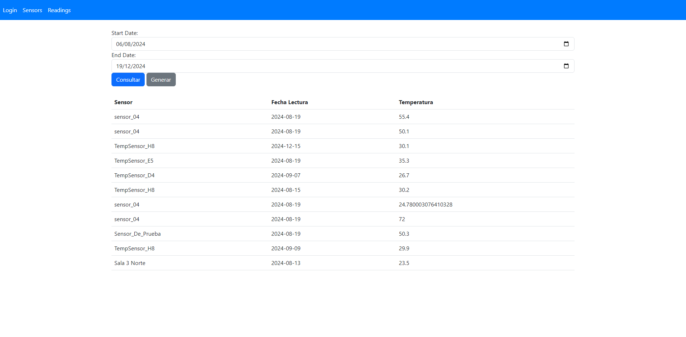

# Api de Sensores de una Fabrica

Esta aplicacion desarrollada en 5 lenguajes diferentes nos permite realizar el mantenimiento de unos sensores de temperatura ubicados estrategicamente en las distintas areas de una fabrica ficticia.

# Funcionamiento

Esta app cuenta con un algoritmo de logueo el cual valida si el usuario esta registrado en la base de datos o no, si sus credenciales coinciden puede acceder al sistema, en caso que no la aplicacion lanzara un error de datos incorrectos.

Luego de ingresar al sistema se podra, como se menciono anteriormente, realizar un mantenimiento de los sensores, para esto se desarrollo un CRUD para la entidad Sensores que nos permite crearlos, obtenerlos, modificarlos y eliminarlos.

Una vez realizado dicho mantenimiento hacia los sensores a gusto del usuario, podra consultar las lecturas de los sensores atraves de un algoritmo de fechas, se ingresan 2 fechas en un rango para determinar la busqueda de la lectura de dicho sensor, tambien
la aplicacion es capaz de generar una lectura hacia un sensor ingresando su nombre y automaticamente se generara con una temperatura.

# Carpetas

En la carpeta Backend se encuentra el proyecto relacionado con toda la logica de la Api.

En la carpeta DataBase se encuentra el script de la base datos para que cualquiera pueda crearla.

En la carpeta Frontend se encuentran las paginas HTML que contiene la interfaz visual de la Api, estas cuentan con ayuda de desarrollo con Bootstrap 5 y JQUERY (Ajax).

# Lenguajes implementados

SQL Server, C#, HTML, CSS Y JavaScript
